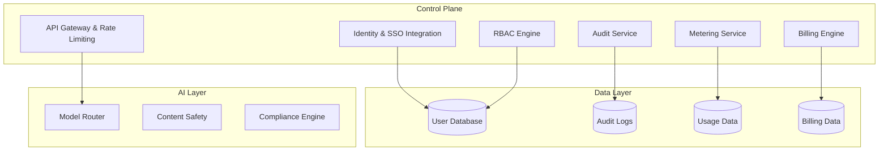

# Enterprise Features Architecture: Technical Specifications

## Executive Summary

This document defines the comprehensive technical architecture for enterprise-grade features required for AI platform adoption at scale. Based on extensive enterprise requirements research, this architecture encompasses seven critical domains: user management system, role-based access control (RBAC), team collaboration features, usage analytics, billing integration, compliance framework, and security architecture.

The design prioritizes multi-tenancy with isolation, real-time metering and cost controls, and compliance-ready audit capabilities. This architecture enables enterprise-grade AI adoption while maintaining security, governance, and operational excellence.

## Table of Contents

1. [Architecture Overview](#architecture-overview)
2. [User Management System](#user-management-system)
3. [Role-Based Access Control (RBAC)](#role-based-access-control-rbac)
4. [Team Collaboration Features](#team-collaboration-features)
5. [Usage Analytics and KPI Framework](#usage-analytics-and-kpi-framework)
6. [Billing Integration and FinOps](#billing-integration-and-finops)
7. [Compliance Framework](#compliance-framework)
8. [Security Architecture](#security-architecture)
9. [Implementation Roadmap](#implementation-roadmap)
10. [API Specifications](#api-specifications)
11. [Data Models](#data-models)

---

## Architecture Overview

### Design Principles

- **Identity Isolation**: Separate tenant boundaries for business-critical workloads
- **Least Privilege**: Fine-grained permission system with workspace scoping
- **Real-time Metering**: Token-level usage tracking for accurate billing and cost control
- **Compliance by Design**: Audit-ready architecture with comprehensive logging
- **API-First**: All features accessible through well-documented APIs
- **Multi-cloud Ready**: Vendor-agnostic design supporting multiple AI providers

### Core Components



---

## User Management System

### Core Capabilities

#### Single Sign-On (SSO) Integration

**Technical Specifications:**
- **Protocols**: SAML 2.0, OpenID Connect (OIDC)
- **Identity Providers**: Azure AD, Okta, Google Workspace, OneLogin, Auth0
- **MFA Support**: TOTP, SMS, WebAuthn, FIDO2
- **Session Management**: Configurable lifetimes, device binding, revocation

**Implementation Details:**
```typescript
interface SSOConfig {
  protocol: 'saml' | 'oidc';
  metadata: {
    ssoUrl: string;
    entityId: string;
    certificate: string;
    oidc?: {
      clientId: string;
      clientSecret: string;
      scopes: string[];
    };
  };
  mfa: {
    required: boolean;
    methods: ('totp' | 'sms' | 'webauthn')[];
    bypassDomains?: string[];
  };
  provisioning: {
    scimEnabled: boolean;
    jitEnabled: boolean;
    autoDeactivate: boolean;
  };
}
```

#### Multi-Tenant Architecture

**Tenant Isolation Levels:**

1. **Resource Isolation** (Basic)
   - Separate subscriptions/resource groups
   - Shared identity domain
   - Suitable for: Non-critical workloads

2. **Tenant Boundary** (Enhanced)
   - Separate Azure AD tenant
   - Independent administrative roles
   - Suitable for: Business-critical applications

3. **Workspace Isolation** (Advanced)
   - Platform-level workspace scoping
   - Scoped secrets and integrations
   - Suitable for: Team-based collaboration

**Implementation:**
```sql
-- Tenant structure
CREATE TABLE tenants (
  id UUID PRIMARY KEY,
  name VARCHAR(255) NOT NULL,
  isolation_level INTEGER NOT NULL, -- 1=Resource, 2=Tenant, 3=Workspace
  subscription_tier VARCHAR(50) NOT NULL,
  created_at TIMESTAMP DEFAULT NOW(),
  updated_at TIMESTAMP DEFAULT NOW(),
  metadata JSONB
);

-- User-tenant relationship
CREATE TABLE user_tenant_access (
  user_id UUID REFERENCES auth.users(id),
  tenant_id UUID REFERENCES tenants(id),
  role VARCHAR(50) NOT NULL,
  scopes TEXT[],
  created_at TIMESTAMP DEFAULT NOW(),
  UNIQUE(user_id, tenant_id)
);
```

### User Lifecycle Management

#### Automated Provisioning

**SCIM 2.0 Implementation:**
```typescript
interface SCIMUser {
  id: string;
  userName: string;
  name: {
    givenName: string;
    familyName: string;
  };
  emails: Array<{
    value: string;
    primary: boolean;
    type: string;
  }>;
  groups: string[];
  active: boolean;
  tenantMemberships: Array<{
    tenantId: string;
    role: string;
    scopes: string[];
  }>;
}

class ProvisioningService {
  async createUser(userData: SCIMUser): Promise<void> {
    // Create user in auth system
    const user = await authService.createUser({
      email: userData.emails[0].value,
      emailVerified: true,
      userMetadata: {
        givenName: userData.name.givenName,
        familyName: userData.name.familyName,
        source: 'scim'
      }
    });

    // Assign to tenant
    for (const membership of userData.tenantMemberships) {
      await this.assignToTenant(user.id, membership.tenantId, membership.role);
    }

    // Log provisioning event
    await this.auditService.log({
      event: 'user_provisioned',
      userId: user.id,
      actor: 'system',
      tenantId: userData.tenantMemberships[0]?.tenantId,
      details: { source: 'scim', method: 'create' }
    });
  }

  async deactivateUser(userId: string): Promise<void> {
    // Remove from all tenant memberships
    await this.userService.removeFromAllTenants(userId);
    
    // Deactivate in auth system
    await authService.deactivateUser(userId);
    
    // Log deactivation
    await this.auditService.log({
      event: 'user_deactivated',
      userId: userId,
      actor: 'system',
      details: { method: 'scim' }
    });
  }
}
```

---

## Role-Based Access Control (RBAC)

### Role Hierarchy

#### Organization-Level Roles

| Role | Permissions | Scope |
|------|-------------|-------|
| **Super Admin** | Full system access, user management, billing | Global |
| **Security Admin** | Security policies, audit logs, compliance | Global |
| **Billing Admin** | Payment methods, invoices, usage reports | Global |
| **Tenant Admin** | Tenant management, user assignment | Tenant |
| **Workspace Admin** | Workspace configuration, team management | Workspace |
| **User** | Standard platform usage | Workspace |
| **Guest** | Limited read-only access | Workspace |

#### Resource-Level Permissions

```typescript
enum Permission {
  // User Management
  USER_CREATE = 'user:create',
  USER_READ = 'user:read',
  USER_UPDATE = 'user:update',
  USER_DELETE = 'user:delete',
  USER_ASSIGN_ROLE = 'user:assign_role',
  
  // Workspace Management
  WORKSPACE_CREATE = 'workspace:create',
  WORKSPACE_READ = 'workspace:read',
  WORKSPACE_UPDATE = 'workspace:update',
  WORKSPACE_DELETE = 'workspace:delete',
  WORKSPACE_MANAGE_MEMBERS = 'workspace:manage_members',
  
  // AI Resources
  MODEL_ACCESS = 'model:access',
  PIPELINE_CREATE = 'pipeline:create',
  PIPELINE_UPDATE = 'pipeline:update',
  PIPELINE_DELETE = 'pipeline:delete',
  EVALUATION_CREATE = 'evaluation:create',
  
  // Secrets & Integrations
  SECRET_READ = 'secret:read',
  SECRET_WRITE = 'secret:write',
  INTEGRATION_MANAGE = 'integration:manage',
  
  // Analytics & Billing
  ANALYTICS_VIEW = 'analytics:view',
  BILLING_VIEW = 'billing:view',
  BILLING_MANAGE = 'billing:manage',
}

interface RoleDefinition {
  name: string;
  description: string;
  permissions: Permission[];
  scopes: ('global' | 'tenant' | 'workspace' | 'resource')[];
  assignable: boolean;
}

const DEFAULT_ROLES: RoleDefinition[] = [
  {
    name: 'workspace_owner',
    description: 'Full workspace control',
    permissions: [
      Permission.WORKSPACE_CREATE,
      Permission.WORKSPACE_READ,
      Permission.WORKSPACE_UPDATE,
      Permission.WORKSPACE_DELETE,
      Permission.WORKSPACE_MANAGE_MEMBERS,
      Permission.USER_ASSIGN_ROLE,
      Permission.MODEL_ACCESS,
      Permission.PIPELINE_CREATE,
      Permission.PIPELINE_UPDATE,
      Permission.PIPELINE_DELETE,
      Permission.SECRET_READ,
      Permission.SECRET_WRITE,
      Permission.INTEGRATION_MANAGE,
      Permission.ANALYTICS_VIEW,
      Permission.BILLING_VIEW
    ],
    scopes: ['workspace'],
    assignable: true
  }
];
```

### Custom Role Engine

**Dynamic Role Creation:**
```typescript
class RoleEngine {
  async createCustomRole(
    tenantId: string,
    baseRoleId: string,
    modifications: {
      addPermissions?: Permission[];
      removePermissions?: Permission[];
      scopeRestrictions?: string[];
    }
  ): Promise<Role> {
    const baseRole = await this.getRole(baseRoleId);
    
    // Create derived role
    const customRole: Role = {
      id: generateUUID(),
      name: `${baseRole.name}_custom_${Date.now()}`,
      description: `Custom role derived from ${baseRole.name}`,
      permissions: this.applyModifications(baseRole.permissions, modifications),
      scopes: modifications.scopeRestrictions || baseRole.scopes,
      tenantId,
      isCustom: true,
      parentRoleId: baseRoleId,
      createdAt: new Date()
    };

    await this.saveRole(customRole);
    return customRole;
  }

  async evaluatePermission(
    userId: string,
    permission: Permission,
    context: { workspaceId?: string; resourceId?: string }
  ): Promise<boolean> {
    const userRoles = await this.getUserRoles(userId, context.workspaceId);
    
    for (const role of userRoles) {
      if (role.permissions.includes(permission)) {
        // Check scope compatibility
        if (await this.validateScope(role, context)) {
          return true;
        }
      }
    }
    
    return false;
  }
}
```

### Scope Validation

**Workspace Scoping:**
```typescript
interface ScopeContext {
  workspaceId?: string;
  resourceId?: string;
  tenantId?: string;
}

class ScopeValidator {
  async validateScope(
    role: Role,
    context: ScopeContext
  ): Promise<boolean> {
    // Global scope: always valid
    if (role.scopes.includes('global')) return true;
    
    // Workspace scope: must have workspace context
    if (role.scopes.includes('workspace')) {
      if (!context.workspaceId) return false;
      
      // Verify user has access to this workspace
      return await this.userHasWorkspaceAccess(
        role.userId,
        context.workspaceId
      );
    }
    
    // Resource scope: must have specific resource context
    if (role.scopes.includes('resource')) {
      if (!context.resourceId) return false;
      
      // Verify access to specific resource
      return await this.userHasResourceAccess(
        role.userId,
        context.resourceId
      );
    }
    
    return false;
  }
}
```

---

## Team Collaboration Features

### Workspace Architecture

**Workspace Structure:**
```typescript
interface Workspace {
  id: string;
  name: string;
  description?: string;
  ownerId: string;
  tenantId: string;
  settings: {
    visibility: 'private' | 'public' | 'organization';
    allowGuestAccess: boolean;
    defaultRole: string;
    aiPersonaLimit: number;
    integrationLimits: {
      maxIntegrations: number;
      maxSecrets: number;
    };
  };
  quotas: {
    users: { max: number; current: number };
    aiPersonas: { max: number; current: number };
    apiCalls: { daily: number; monthly: number };
    storage: { max: number; current: number };
  };
  createdAt: Date;
  updatedAt: Date;
}

interface WorkspaceMember {
  id: string;
  workspaceId: string;
  userId: string;
  role: string; // workspace role, not permission role
  permissions: Permission[];
  invitedBy: string;
  invitedAt: Date;
  joinedAt?: Date;
  status: 'invited' | 'active' | 'suspended';
}
```

### AI Persona Collaboration

**Persona System:**
```typescript
interface AIPersona {
  id: string;
  name: string;
  description: string;
  workspaceId: string;
  creatorId: string;
  
  configuration: {
    systemPrompt: string;
    capabilities: string[];
    knowledgeBase: {
      documents: string[];
      dataConnectors: string[];
    };
    safetySettings: {
      contentFilter: boolean;
      toxicityThreshold: number;
      biasDetection: boolean;
    };
    modelPreferences: {
      primaryModel: string;
      fallbackModels: string[];
      temperature: number;
      maxTokens: number;
    };
  };
  
  collaboration: {
    sharedWith: Array<{
      userId: string;
      role: 'viewer' | 'collaborator' | 'manager';
      permissions: Permission[];
      canShare: boolean;
    }>;
    isPublic: boolean;
    allowDM: boolean;
    dmRestrictions?: {
      allowedUsers: string[];
      blockedUsers: string[];
    };
  };
  
  analytics: {
    usageCount: number;
    avgResponseTime: number;
    feedbackScore: number;
    lastUsedAt: Date;
  };
  
  createdAt: Date;
  updatedAt: Date;
}

class PersonaCollaboration {
  async sharePersona(
    personaId: string,
    targetUserId: string,
    role: 'viewer' | 'collaborator' | 'manager',
    permissions: Permission[]
  ): Promise<void> {
    // Validate sharer permissions
    const sharerRole = await this.getUserWorkspaceRole(this.userId, this.workspaceId);
    if (!sharerRole.permissions.includes(Permission.PERSONA_SHARE)) {
      throw new Error('Insufficient permissions to share persona');
    }

    // Validate target user
    const targetUser = await this.userService.getUser(targetUserId);
    if (!targetUser) throw new Error('Target user not found');

    // Check workspace membership
    const workspaceMembership = await this.getWorkspaceMember(this.workspaceId, targetUserId);
    if (!workspaceMembership) {
      throw new Error('Target user must be workspace member');
    }

    // Create sharing relationship
    await this.personaService.addCollaborator(personaId, {
      userId: targetUserId,
      role,
      permissions,
      sharedBy: this.userId,
      sharedAt: new Date()
    });

    // Log collaboration event
    await this.auditService.log({
      event: 'persona_shared',
      userId: this.userId,
      targetUserId,
      resourceId: personaId,
      details: { role, permissions }
    });
  }
}
```

### Team Channels

**Channel System:**
```typescript
interface Channel {
  id: string;
  name: string;
  type: 'public' | 'private' | 'direct';
  workspaceId: string;
  createdBy: string;
  
  members: Array<{
    userId: string;
    role: 'owner' | 'admin' | 'member' | 'guest';
    joinedAt: Date;
    permissions: Permission[];
  }>;
  
  aiPersonas: string[]; // Shared personas for this channel
  
  settings: {
    autoJoin: boolean;
    allowPersonaCreation: boolean;
    messageRetention: number; // days
    allowFileUploads: boolean;
    maxFileSize: number; // bytes
  };
  
  createdAt: Date;
  updatedAt: Date;
}

interface Message {
  id: string;
  channelId: string;
  senderId: string;
  content: {
    text?: string;
    attachments?: Array<{
      id: string;
      name: string;
      url: string;
      type: string;
      size: number;
    }>;
    personaResponse?: {
      personaId: string;
      response: string;
      confidence: number;
      tokensUsed: number;
    };
  };
  
  metadata: {
    clientInfo: string;
    timestamp: Date;
    editHistory?: Array<{
      content: string;
      editedAt: Date;
    }>;
    reactions?: Array<{
      emoji: string;
      userIds: string[];
    }>;
  };
}
```

---

## Usage Analytics and KPI Framework

### Analytics Architecture

**Real-time Metrics Pipeline:**
```typescript
interface UsageEvent {
  id: string;
  userId: string;
  workspaceId: string;
  tenantId: string;
  
  event: {
    type: 'api_call' | 'persona_interaction' | 'channel_message' | 'file_upload';
    timestamp: Date;
    source: 'web' | 'api' | 'mobile' | 'webhook';
  };
  
  resource: {
    model?: string;
    persona?: string;
    channel?: string;
    pipeline?: string;
  };
  
  billing: {
    tokensInput: number;
    tokensOutput: number;
    cost: number;
    currency: string;
  };
  
  quality?: {
    responseTime: number;
    confidence: number;
    feedbackScore?: number;
  };
  
  context: {
    sessionId: string;
    requestId: string;
    userAgent: string;
    ipAddress: string;
    metadata?: Record<string, any>;
  };
}

class AnalyticsService {
  private eventStream: EventEmitter;
  private batchProcessor: BatchProcessor;
  
  constructor() {
    this.eventStream = new EventEmitter();
    this.setupPipelines();
  }
  
  async trackUsageEvent(event: UsageEvent): Promise<void> {
    // Store in real-time storage (Redis)
    await this.realTimeStore.store(event);
    
    // Batch for analytics warehouse
    await this.batchProcessor.add(event);
    
    // Emit for real-time dashboards
    this.eventStream.emit('usage', event);
    
    // Update quotas in real-time
    await this.quotaManager.updateUsage(event.userId, event.workspaceId, {
      tokens: event.billing.tokensInput + event.billing.tokensOutput,
      cost: event.cost,
      timestamp: event.event.timestamp
    });
  }
  
  private setupPipelines(): void {
    // Quality metrics pipeline
    this.eventStream.on('usage', async (event: UsageEvent) => {
      if (event.quality) {
        await this.updateQualityMetrics(event);
      }
    });
    
    // Cost tracking pipeline
    this.eventStream.on('usage', async (event: UsageEvent) => {
      await this.costTracker.recordCost(event);
    });
    
    // Compliance pipeline
    this.eventStream.on('usage', async (event: UsageEvent) => {
      await this.complianceTracker.trackEvent(event);
    });
  }
}
```

### KPI Dashboard Framework

**Key Performance Indicators:**
```typescript
interface KPIMetrics {
  // Model Quality Metrics
  precision: number;
  recall: number;
  f1Score: number;
  groundedness: number;
  safety: {
    toxicityScore: number;
    harmfulContentRate: number;
    biasScore: number;
  };
  
  // System Performance
  uptime: number;
  errorRate: number;
  latency: {
    p50: number;
    p95: number;
    p99: number;
  };
  throughput: {
    requestsPerSecond: number;
    tokensPerSecond: number;
  };
  
  // Business Metrics
  costPerRequest: number;
  costPerToken: number;
  userSatisfaction: number;
  featureAdoption: {
    activeUsers: number;
    weeklyActiveUsers: number;
    monthlyActiveUsers: number;
    retentionRate: number;
  };
  
  // AI-Specific
  containmentRate: number; // % queries resolved by AI
  escalationRate: number;  // % requiring human intervention
  sessionLength: number;   // avg conversation length
  returnUserRate: number;  // % users returning within 7 days
}

class KPIService {
  async calculateMetrics(
    timeframe: { start: Date; end: Date },
    filters: { workspaceId?: string; tenantId?: string }
  ): Promise<KPIMetrics> {
    const events = await this.getEvents(timeframe, filters);
    
    return {
      precision: this.calculatePrecision(events),
      recall: this.calculateRecall(events),
      f1Score: this.calculateF1(events),
      groundedness: this.calculateGroundedness(events),
      safety: this.calculateSafetyMetrics(events),
      uptime: this.calculateUptime(timeframe),
      errorRate: this.calculateErrorRate(events),
      latency: this.calculateLatencyPercentiles(events),
      throughput: this.calculateThroughput(events),
      costPerRequest: this.calculateCostPerRequest(events),
      costPerToken: this.calculateCostPerToken(events),
      userSatisfaction: await this.calculateUserSatisfaction(filters),
      featureAdoption: await this.calculateFeatureAdoption(timeframe, filters),
      containmentRate: this.calculateContainmentRate(events),
      escalationRate: this.calculateEscalationRate(events),
      sessionLength: this.calculateSessionLength(events),
      returnUserRate: this.calculateReturnUserRate(timeframe, filters)
    };
  }
}
```

### Real-time Dashboards

**Dashboard Data Model:**
```typescript
interface DashboardWidget {
  id: string;
  type: 'metric' | 'chart' | 'table' | 'alert';
  title: string;
  
  config: {
    metric: string;
    aggregation: 'sum' | 'avg' | 'count' | 'min' | 'max';
    timeframe: '1h' | '24h' | '7d' | '30d';
    filters?: Record<string, any>;
    visualization: 'line' | 'bar' | 'pie' | 'heatmap';
    thresholds?: {
      warning: number;
      critical: number;
    };
  };
  
  permissions: Permission[];
  refreshRate: number; // seconds
}

class DashboardService {
  async getUserDashboard(
    userId: string,
    workspaceId: string
  ): Promise<DashboardWidget[]> {
    // Get user's widget preferences
    const preferences = await this.userPreferenceService.getPreferences(
      userId,
      `dashboard_${workspaceId}`
    );
    
    // Validate permissions for each widget
    const authorizedWidgets = [];
    for (const widgetId of preferences.widgets) {
      const widget = await this.getWidget(widgetId);
      if (await this.hasPermission(userId, widget.permissions, workspaceId)) {
        authorizedWidgets.push(widget);
      }
    }
    
    return authorizedWidgets;
  }
  
  async updateWidgetData(widgetId: string): Promise<any> {
    const widget = await this.getWidget(widgetId);
    const data = await this.queryMetrics(widget.config);
    
    return {
      widgetId,
      data,
      lastUpdated: new Date(),
      nextUpdate: new Date(Date.now() + widget.refreshRate * 1000)
    };
  }
}
```

---

## Billing Integration and FinOps

### Billing Architecture

**Metering System:**
```typescript
interface UsageRecord {
  id: string;
  userId: string;
  workspaceId: string;
  tenantId: string;
  
  usage: {
    type: 'token' | 'request' | 'storage' | 'compute';
    quantity: number;
    unit: string;
    model?: string; // For token-based usage
  };
  
  cost: {
    amount: number;
    currency: string;
    rate: number; // cost per unit
  };
  
  metadata: {
    timestamp: Date;
    requestId: string;
    sessionId: string;
    features?: string[];
  };
  
  billingPeriod: {
    start: Date;
    end: Date;
  };
}

class MeteringService {
  private billingProvider: BillingProvider;
  private usageAggregator: UsageAggregator;
  
  async recordUsage(usage: UsageRecord): Promise<void> {
    // Store usage immediately
    await this.storeUsage(usage);
    
    // Update running totals
    await this.usageAggregator.increment(
      usage.tenantId,
      usage.usage.type,
      usage.usage.quantity,
      usage.cost.amount
    );
    
    // Check quotas and limits
    await this.quotaService.checkAndEnforce(usage);
    
    // Send to billing provider
    await this.billingProvider.recordUsage(usage);
  }
  
  async generateInvoice(
    tenantId: string,
    billingPeriod: { start: Date; end: Date }
  ): Promise<Invoice> {
    const usage = await this.getUsageForPeriod(tenantId, billingPeriod);
    const subscription = await this.getSubscription(tenantId);
    
    return {
      id: generateUUID(),
      tenantId,
      period: billingPeriod,
      lineItems: this.calculateLineItems(usage, subscription),
      subtotal: 0,
      taxes: 0,
      total: 0,
      currency: 'USD',
      dueDate: new Date(Date.now() + 30 * 24 * 60 * 60 * 1000), // 30 days
      status: 'pending'
    };
  }
}
```

### Pricing Models

**Flexible Pricing Engine:**
```typescript
interface PricingTier {
  id: string;
  name: string;
  
  limits: {
    monthlyTokens: number;
    requestsPerMinute: number;
    concurrentRequests: number;
    storageGB: number;
    workspaces: number;
  };
  
  pricing: {
    basePrice: number; // Monthly subscription
    tokenRate: number; // Cost per 1K tokens
    overageRate: number; // Rate for exceeding limits
    discountTiers?: Array<{
      threshold: number; // Volume threshold
      discount: number; // Percentage discount
    }>;
  };
  
  features: string[];
  isPublic: boolean;
}

class PricingEngine {
  async calculateCost(
    usage: UsageRecord,
    subscription: Subscription
  ): Promise<CostBreakdown> {
    const tier = await this.getPricingTier(subscription.tierId);
    
    let baseCost = 0;
    let variableCost = 0;
    let overageCost = 0;
    
    if (usage.usage.type === 'token') {
      const tokensUsed = usage.usage.quantity;
      const tokensIncluded = tier.limits.monthlyTokens;
      
      if (tokensUsed <= tokensIncluded) {
        variableCost = (tokensUsed / 1000) * tier.pricing.tokenRate;
      } else {
        const includedCost = (tokensIncluded / 1000) * tier.pricing.tokenRate;
        const overageTokens = tokensUsed - tokensIncluded;
        overageCost = (overageTokens / 1000) * tier.pricing.overageRate;
        variableCost = includedCost + overageCost;
      }
    }
    
    return {
      baseCost: tier.pricing.basePrice,
      variableCost,
      overageCost,
      subtotal: tier.pricing.basePrice + variableCost,
      discounts: await this.calculateDiscounts(usage, tier),
      taxes: 0, // Calculate based on jurisdiction
      total: 0
    };
  }
  
  async calculateDiscounts(
    usage: UsageRecord,
    tier: PricingTier
  ): Promise<Discount[]> {
    if (!tier.pricing.discountTiers) return [];
    
    const monthlyUsage = await this.getMonthlyUsage(usage.tenantId);
    const applicableDiscounts = [];
    
    for (const discountTier of tier.pricing.discountTiers) {
      if (monthlyUsage >= discountTier.threshold) {
        applicableDiscounts.push({
          type: 'volume',
          description: `Volume discount for ${discountTier.threshold}+ tokens`,
          percentage: discountTier.discount,
          amount: (usage.cost.amount * discountTier.discount) / 100
        });
      }
    }
    
    return applicableDiscounts;
  }
}
```

### FinOps Dashboard

**Cost Analytics:**
```typescript
interface CostAnalytics {
  totalSpend: number;
  spendTrend: Array<{ date: Date; amount: number }>;
  costByCategory: Array<{
    category: string;
    amount: number;
    percentage: number;
  }>;
  costByWorkspace: Array<{
    workspaceId: string;
    workspaceName: string;
    amount: number;
    percentage: number;
  }>;
  costByUser: Array<{
    userId: string;
    userName: string;
    amount: number;
    percentage: number;
  }>;
  budgetUtilization: {
    allocated: number;
    used: number;
    remaining: number;
    percentage: number;
    projectedOverage: number;
  };
  anomalyDetection: Array<{
    date: Date;
    amount: number;
    expectedAmount: number;
    deviation: number;
    reason: string;
  }>;
}

class FinOpsService {
  async generateCostReport(
    tenantId: string,
    timeframe: { start: Date; end: Date },
    groupBy: 'day' | 'week' | 'month' | 'workspace' | 'user'
  ): Promise<CostAnalytics> {
    const usage = await this.getUsageData(tenantId, timeframe);
    
    return {
      totalSpend: usage.reduce((sum, u) => sum + u.cost.amount, 0),
      spendTrend: this.calculateTrend(usage, groupBy),
      costByCategory: this.calculateCostByCategory(usage),
      costByWorkspace: await this.calculateCostByWorkspace(usage),
      costByUser: await this.calculateCostByUser(usage),
      budgetUtilization: await this.calculateBudgetUtilization(tenantId, timeframe),
      anomalyDetection: await this.detectCostAnomalies(usage)
    };
  }
  
  async detectCostAnomalies(usage: UsageRecord[]): Promise<AnomalyDetection[]> {
    // Simple statistical anomaly detection
    const dailyCosts = this.aggregateByDay(usage);
    const mean = dailyCosts.reduce((sum, day) => sum + day.amount, 0) / dailyCosts.length;
    const variance = dailyCosts.reduce((sum, day) => sum + Math.pow(day.amount - mean, 2), 0) / dailyCosts.length;
    const stdDev = Math.sqrt(variance);
    
    return dailyCosts
      .filter(day => Math.abs(day.amount - mean) > 2 * stdDev)
      .map(day => ({
        date: day.date,
        amount: day.amount,
        expectedAmount: mean,
        deviation: Math.abs(day.amount - mean),
        reason: day.amount > mean ? 'unusually_high' : 'unusually_low'
      }));
  }
}
```

### Fraud Detection

**Risk Scoring System:**
```typescript
interface RiskSignal {
  type: 'velocity' | 'pattern' | 'geographic' | 'behavioral';
  score: number; // 0-100
  weight: number;
  metadata: Record<string, any>;
}

interface FraudDetection {
  userId: string;
  riskScore: number; // 0-100
  signals: RiskSignal[];
  action: 'allow' | 'monitor' | 'throttle' | 'block';
  reason: string;
  timestamp: Date;
}

class FraudDetectionService {
  async evaluateRisk(usage: UsageRecord): Promise<FraudDetection> {
    const signals: RiskSignal[] = [];
    
    // Velocity check
    const velocitySignal = await this.checkVelocity(usage);
    if (velocitySignal.score > 0) signals.push(velocitySignal);
    
    // Pattern analysis
    const patternSignal = await this.checkUsagePatterns(usage);
    if (patternSignal.score > 0) signals.push(patternSignal);
    
    // Geographic anomaly
    const geoSignal = await this.checkGeographicAnomaly(usage);
    if (geoSignal.score > 0) signals.push(geoSignal);
    
    // Behavioral analysis
    const behaviorSignal = await this.checkBehavioralAnomaly(usage);
    if (behaviorSignal.score > 0) signals.push(behaviorSignal);
    
    const totalScore = signals.reduce((sum, signal) => 
      sum + (signal.score * signal.weight), 0
    );
    
    const action = this.determineAction(totalScore);
    
    return {
      userId: usage.userId,
      riskScore: Math.min(totalScore, 100),
      signals,
      action,
      reason: this.generateReason(signals, action),
      timestamp: new Date()
    };
  }
  
  private determineAction(score: number): 'allow' | 'monitor' | 'throttle' | 'block' {
    if (score < 30) return 'allow';
    if (score < 50) return 'monitor';
    if (score < 75) return 'throttle';
    return 'block';
  }
}
```

---

## Compliance Framework

### Audit Logging System

**Comprehensive Audit Trail:**
```typescript
interface AuditEvent {
  id: string;
  timestamp: Date;
  
  actor: {
    userId: string;
    userName: string;
    sessionId: string;
    ipAddress: string;
    userAgent: string;
  };
  
  action: {
    type: 'create' | 'read' | 'update' | 'delete' | 'login' | 'logout';
    resource: string;
    resourceId?: string;
    method?: string; // HTTP method for API calls
  };
  
  outcome: 'success' | 'failure' | 'partial';
  
  context: {
    workspaceId?: string;
    tenantId?: string;
    source: 'web' | 'api' | 'mobile' | 'system';
    correlationId?: string;
  };
  
  details: {
    oldValue?: any;
    newValue?: any;
    errorMessage?: string;
    errorCode?: string;
    metadata?: Record<string, any>;
  };
  
  compliance: {
    piiAccess: boolean;
    sensitiveData: boolean;
    retentionRequired: boolean;
    retentionPeriod?: number; // days
  };
}

class AuditService {
  private logStore: LogStore;
  private eventBus: EventBus;
  
  async log(event: Partial<AuditEvent>): Promise<void> {
    const fullEvent: AuditEvent = {
      id: generateUUID(),
      timestamp: new Date(),
      actor: {
        userId: event.actor?.userId || 'system',
        userName: event.actor?.userName || 'System',
        sessionId: event.actor?.sessionId || '',
        ipAddress: event.actor?.ipAddress || '',
        userAgent: event.actor?.userAgent || ''
      },
      action: event.action!,
      outcome: event.outcome || 'success',
      context: event.context || {},
      details: event.details || {},
      compliance: this.determineComplianceRequirements(event)
    };
    
    // Store in immutable log (append-only)
    await this.logStore.append(fullEvent);
    
    // Stream to SIEM
    await this.streamToSIEM(fullEvent);
    
    // Check for real-time alerts
    await this.checkAlertRules(fullEvent);
    
    // Emit for real-time monitoring
    this.eventBus.emit('audit_event', fullEvent);
  }
  
  private determineComplianceRequirements(event: Partial<AuditEvent>): AuditEvent['compliance'] {
    const isPII = this.detectPII(event.details?.newValue || event.details?.oldValue);
    const isSensitive = this.detectSensitiveData(event.action?.resource);
    
    return {
      piiAccess: isPII,
      sensitiveData: isSensitive,
      retentionRequired: isPII || isSensitive,
      retentionPeriod: isPII ? 2555 : isSensitive ? 2555 : 365 // ~7 years for PII, 1 year for other
    };
  }
}
```

### Compliance Controls Matrix

**SOC 2 Controls:**
```typescript
interface ComplianceControl {
  id: string;
  framework: 'SOC2' | 'GDPR' | 'HIPAA' | 'PCI';
  category: string;
  control: string;
  
  implementation: {
    automated: boolean;
    frequency: 'continuous' | 'daily' | 'weekly' | 'monthly' | 'quarterly' | 'annually';
    evidence: string[];
    owner: string;
    lastTested: Date;
    nextTestDue: Date;
    status: 'pass' | 'fail' | 'warning' | 'not_tested';
  };
  
  auditLogEvents: string[];
  policyReferences: string[];
}

const SOC2_CONTROLS: ComplianceControl[] = [
  {
    id: 'CC6.1',
    framework: 'SOC2',
    category: 'Logical and Physical Access Controls',
    control: 'The entity implements logical and physical access controls to restrict unauthorized access to the system.',
    implementation: {
      automated: true,
      frequency: 'continuous',
      evidence: ['audit_logs', 'access_controls', 'user_provisioning'],
      owner: 'Security Team',
      lastTested: new Date(),
      nextTestDue: new Date(Date.now() + 90 * 24 * 60 * 60 * 1000),
      status: 'pass'
    },
    auditLogEvents: ['user_login', 'user_provision', 'permission_change', 'access_denied'],
    policyReferences: ['access_control_policy', 'user_management_procedure']
  },
  {
    id: 'CC7.2',
    framework: 'SOC2',
    category: 'System Operations',
    control: 'The entity monitors system components and the operation of those components.',
    implementation: {
      automated: true,
      frequency: 'continuous',
      evidence: ['monitoring_alerts', 'system_logs', 'performance_metrics'],
      owner: 'Operations Team',
      lastTested: new Date(),
      nextTestDue: new Date(Date.now() + 30 * 24 * 60 * 60 * 1000),
      status: 'pass'
    },
    auditLogEvents: ['system_alert', 'performance_threshold', 'error_event'],
    policyReferences: ['monitoring_procedure', 'incident_response_plan']
  }
];
```

### GDPR Compliance

**Data Subject Rights:**
```typescript
interface GDPRRequest {
  id: string;
  requestorId: string;
  subjectId: string;
  type: 'access' | 'rectification' | 'erasure' | 'portability' | 'restriction' | 'objection';
  status: 'pending' | 'in_progress' | 'completed' | 'rejected';
  receivedAt: Date;
  dueDate: Date; // 30 days from receipt
  completedAt?: Date;
  
  details: {
    reason?: string;
    dataCategories?: string[];
    retentionJustification?: string;
  };
  
  response: {
    dataExported?: Buffer;
    deletionCompleted?: boolean;
    limitationApplied?: boolean;
    reasonForRejection?: string;
  };
}

class GDPRService {
  async handleDataSubjectRequest(request: GDPRRequest): Promise<void> {
    // Verify requestor authority
    if (!await this.verifyRequestor(request.requestorId, request.subjectId)) {
      await this.rejectRequest(request, 'Unauthorized requestor');
      return;
    }
    
    await this.updateRequestStatus(request.id, 'in_progress');
    
    try {
      switch (request.type) {
        case 'access':
          await this.handleAccessRequest(request);
          break;
        case 'rectification':
          await this.handleRectificationRequest(request);
          break;
        case 'erasure':
          await this.handleErasureRequest(request);
          break;
        case 'portability':
          await this.handlePortabilityRequest(request);
          break;
        case 'restriction':
          await this.handleRestrictionRequest(request);
          break;
        case 'objection':
          await this.handleObjectionRequest(request);
          break;
      }
      
      await this.updateRequestStatus(request.id, 'completed');
    } catch (error) {
      await this.updateRequestStatus(request.id, 'rejected');
      throw error;
    }
  }
  
  private async handleAccessRequest(request: GDPRRequest): Promise<void> {
    const userData = await this.getAllUserData(request.subjectId);
    
    // Filter PII and sensitive data
    const accessibleData = {
      personalData: this.filterPII(userData.personal),
      usageData: this.filterPII(userData.usage),
      aiInteractions: this.filterPII(userData.interactions),
      billingData: this.filterPII(userData.billing),
      metadata: userData.metadata
    };
    
    // Generate export
    const exportData = JSON.stringify(accessibleData, null, 2);
    const fileName = `data_export_${request.subjectId}_${Date.now()}.json`;
    
    await this.storeExport(request.id, exportData, fileName);
    
    // Log the export
    await this.auditService.log({
      action: { type: 'read', resource: 'user_data_export' },
      details: { subjectId: request.subjectId, requestId: request.id },
      outcome: 'success'
    });
  }
}
```

### HIPAA Compliance

**PHI Protection:**
```typescript
interface PHIAccessLog {
  id: string;
  userId: string;
  patientId?: string;
  dataType: 'demographic' | 'clinical' | 'billing' | 'administrative';
  accessType: 'view' | 'create' | 'update' | 'delete' | 'export';
  justification: string;
  timestamp: Date;
  ipAddress: string;
  sessionId: string;
  outcome: 'granted' | 'denied';
}

class HIPAACompliance {
  async logPHIAccess(log: PHIAccessLog): Promise<void> {
    // Check minimum necessary access
    const hasAccess = await this.validateMinimumNecessaryAccess(log);
    
    if (!hasAccess) {
      await this.auditService.log({
        action: {
          type: 'read',
          resource: 'phi_data',
          resourceId: log.patientId
        },
        outcome: 'failure',
        details: {
          errorCode: 'INSUFFICIENT_ACCESS',
          reason: 'Access does not meet minimum necessary standard'
        }
      });
      return;
    }
    
    // Store detailed PHI access log
    await this.phiLogStore.store({
      ...log,
      outcome: 'granted',
      encrypted: true
    });
    
    // Check for unusual access patterns
    await this.checkUnusualAccessPatterns(log);
  }
  
  private async validateMinimumNecessaryAccess(log: PHIAccessLog): Promise<boolean> {
    const user = await this.getUser(log.userId);
    const role = await this.getUserRole(log.userId);
    
    // Check if user role allows this type of PHI access
    const allowedTypes = this.getAllowedPHITypes(role);
    if (!allowedTypes.includes(log.dataType)) {
      return false;
    }
    
    // Check if user has justification provided
    if (!log.justification || log.justification.length < 10) {
      return false;
    }
    
    return true;
  }
}
```

---

## Security Architecture

### Zero Trust Framework

**Authentication & Authorization:**
```typescript
interface SecurityContext {
  userId: string;
  sessionId: string;
  workspaceId?: string;
  tenantId: string;
  ipAddress: string;
  userAgent: string;
  deviceFingerprint: string;
  trustScore: number;
  riskFactors: RiskFactor[];
  permissions: Permission[];
}

interface RiskFactor {
  type: 'unknown_device' | 'unusual_location' | 'after_hours' | 'velocity' | 'failed_attempts';
  severity: 'low' | 'medium' | 'high' | 'critical';
  score: number;
  detectedAt: Date;
}

class SecurityService {
  async authenticate(request: AuthRequest): Promise<AuthResult> {
    // Multi-factor authentication
    if (!await this.validateMFA(request.userId, request.mfaToken)) {
      await this.recordFailedAttempt(request.userId, 'mfa_failed');
      throw new AuthenticationError('MFA validation failed');
    }
    
    // Device fingerprinting
    const deviceTrust = await this.evaluateDevice(request.deviceFingerprint);
    
    // Behavioral analysis
    const behaviorScore = await this.analyzeBehavior(request.userId, request);
    
    const trustScore = this.calculateTrustScore(deviceTrust, behaviorScore);
    const securityContext = await this.buildSecurityContext(request, trustScore);
    
    return {
      success: true,
      sessionId: generateUUID(),
      securityContext,
      riskLevel: trustScore < 50 ? 'high' : trustScore < 80 ? 'medium' : 'low'
    };
  }
  
  async authorize(
    context: SecurityContext,
    resource: string,
    action: string
  ): Promise<AuthorizationResult> {
    // Check RBAC permissions
    const hasPermission = await this.checkPermissions(context, resource, action);
    if (!hasPermission) {
      return { allowed: false, reason: 'insufficient_permissions' };
    }
    
    // Check resource-level access
    const resourceAccess = await this.checkResourceAccess(context, resource);
    if (!resourceAccess.allowed) {
      return { allowed: false, reason: 'resource_access_denied', details: resourceAccess };
    }
    
    // Dynamic risk assessment
    const riskAssessment = await this.assessRisk(context);
    if (riskAssessment.riskLevel === 'critical') {
      return { allowed: false, reason: 'high_risk_activity', details: riskAssessment };
    }
    
    return { allowed: true, riskLevel: riskAssessment.riskLevel };
  }
}
```

### Network Security

**VPC and Segmentation:**
```typescript
interface NetworkPolicy {
  id: string;
  name: string;
  type: 'ingress' | 'egress' | 'zero_trust';
  
  rules: Array<{
    source: {
      ipRanges?: string[];
      namespaces?: string[];
      podSelectors?: string[];
    };
    destination: {
      ipRanges?: string[];
      namespaces?: string[];
      podSelectors?: string[];
      ports?: number[];
    };
    action: 'allow' | 'deny';
    protocols: ('tcp' | 'udp' | 'icmp')[];
    ports?: number[];
  }>;
  
  appliedTo: {
    namespaces?: string[];
    labels?: Record<string, string>;
  };
  
  metadata: {
    createdAt: Date;
    updatedAt: Date;
    createdBy: string;
    priority: number;
  };
}

class NetworkSecurity {
  async enforceZeroTrustPolicy(
    sourceContext: SecurityContext,
    destination: string,
    port: number
  ): Promise<boolean> {
    // Check if source is trusted
    const sourceTrust = await this.evaluateSourceTrust(sourceContext);
    if (sourceTrust < 0.8) {
      return false;
    }
    
    // Verify destination is authorized
    const destAuth = await this.verifyDestination(destination, port);
    if (!destAuth.authorized) {
      await this.auditService.log({
        action: {
          type: 'access',
          resource: 'network_destination',
          resourceId: `${destination}:${port}`
        },
        outcome: 'failure',
        details: {
          reason: 'unauthorized_destination',
          sourceTrust
        }
      });
      return false;
    }
    
    // Check for lateral movement indicators
    const lateralMovement = await this.detectLateralMovement(sourceContext, destination);
    if (lateralMovement.detected) {
      await this.handleLateralMovement(sourceContext, lateralMovement);
      return false;
    }
    
    return true;
  }
}
```

### Encryption and Key Management

**End-to-End Encryption:**
```typescript
interface EncryptionConfig {
  algorithm: 'AES-256-GCM' | 'ChaCha20-Poly1305';
  keyDerivation: 'PBKDF2' | 'Argon2id';
  rotationPeriod: number; // days
  keyHierarchy: {
    masterKey: string;
    tenantKeys: Record<string, string>;
    workspaceKeys: Record<string, string>;
    resourceKeys: Record<string, string>;
  };
}

class EncryptionService {
  private kms: KeyManagementService;
  
  async encryptSensitiveData(
    data: any,
    context: SecurityContext
  ): Promise<EncryptedData> {
    // Get encryption key for workspace or resource
    const encryptionKey = await this.getEncryptionKey(context.workspaceId, context.resourceId);
    
    // Generate unique IV for this encryption
    const iv = crypto.randomBytes(12);
    
    // Encrypt data
    const cipher = crypto.createCipher('aes-256-gcm', encryptionKey);
    cipher.setAAD(Buffer.from(context.sessionId));
    
    let encrypted = cipher.update(JSON.stringify(data), 'utf8', 'hex');
    encrypted += cipher.final('hex');
    
    const authTag = cipher.getAuthTag();
    
    return {
      encrypted: encrypted,
      iv: iv.toString('hex'),
      authTag: authTag.toString('hex'),
      algorithm: 'AES-256-GCM',
      keyId: encryptionKey.id,
      encryptedAt: new Date()
    };
  }
  
  async rotateKeys(tenantId: string): Promise<void> {
    // Generate new keys
    const newKeys = await this.kms.generateKeys({
      algorithm: 'RSA-4096',
      purpose: 'encryption',
      tenantId
    });
    
    // Re-encrypt all tenant data with new keys
    const tenantData = await this.getTenantData(tenantId);
    for (const record of tenantData) {
      const decrypted = await this.decrypt(record.encryptedData);
      const reEncrypted = await this.encrypt(decrypted, record.context);
      await this.updateEncryptedData(record.id, reEncrypted);
    }
    
    // Mark old keys for deletion after grace period
    await this.scheduleKeyDeletion(tenantId, 30); // 30 days
    
    // Log key rotation
    await this.auditService.log({
      action: {
        type: 'update',
        resource: 'encryption_keys',
        resourceId: tenantId
      },
      outcome: 'success',
      details: {
        event: 'key_rotation',
        newKeyId: newKeys.id,
        dataRecordsUpdated: tenantData.length
      }
    });
  }
}
```

### Security Monitoring

**Intrusion Detection:**
```typescript
interface SecurityAlert {
  id: string;
  severity: 'low' | 'medium' | 'high' | 'critical';
  category: 'intrusion' | 'malware' | 'data_exfiltration' | 'privilege_escalation' | 'anomalous_behavior';
  source: string;
  description: string;
  
  indicators: Array<{
    type: 'ip' | 'user' | 'process' | 'file' | 'network';
    value: string;
    confidence: number;
  }>;
  
  timeline: Array<{
    timestamp: Date;
    event: string;
    details: Record<string, any>;
  }>;
  
  response: {
    status: 'open' | 'investigating' | 'contained' | 'resolved' | 'false_positive';
    actions: SecurityAction[];
    assignedTo?: string;
    resolvedAt?: Date;
    notes?: string;
  };
  
  metadata: {
    correlationId?: string;
    falsePositiveRate: number;
    resolutionTime?: number;
  };
}

class SecurityMonitoring {
  async detectAnomalousBehavior(userId: string): Promise<SecurityAlert[]> {
    const alerts: SecurityAlert[] = [];
    
    // Failed login patterns
    const failedLogins = await this.getFailedLoginAttempts(userId, '24h');
    if (failedLogins.length > 5) {
      alerts.push({
        id: generateUUID(),
        severity: 'high',
        category: 'anomalous_behavior',
        source: 'auth_system',
        description: `Excessive failed login attempts: ${failedLogins.length} in 24h`,
        indicators: [{
          type: 'user',
          value: userId,
          confidence: 0.9
        }],
        timeline: failedLogins.map(login => ({
          timestamp: login.timestamp,
          event: 'failed_login',
          details: { ipAddress: login.ipAddress, userAgent: login.userAgent }
        })),
        response: {
          status: 'open',
          actions: [
            { type: 'block_ip', parameters: { ipAddress: failedLogins[0].ipAddress } },
            { type: 'require_mfa', parameters: { userId } }
          ]
        },
        metadata: {}
      });
    }
    
    // Unusual access patterns
    const accessPattern = await this.analyzeAccessPattern(userId);
    if (accessPattern.deviationScore > 0.8) {
      alerts.push({
        id: generateUUID(),
        severity: 'medium',
        category: 'anomalous_behavior',
        source: 'behavioral_analysis',
        description: 'User accessing resources outside normal pattern',
        indicators: [{
          type: 'user',
          value: userId,
          confidence: accessPattern.deviationScore
        }],
        timeline: [{
          timestamp: new Date(),
          event: 'pattern_anomaly',
          details: accessPattern
        }],
        response: {
          status: 'open',
          actions: [
            { type: 'require_additional_verification', parameters: { userId } }
          ]
        },
        metadata: {}
      });
    }
    
    return alerts;
  }
}
```

---

## Implementation Roadmap

### Phase 1: Foundation (Months 1-2)

**Milestones:**
- [ ] Identity and SSO integration (SAML/OIDC)
- [ ] Basic RBAC implementation
- [ ] Workspace management system
- [ ] User provisioning/deprovisioning
- [ ] Basic audit logging

**Success Criteria:**
- Users can authenticate via enterprise SSO
- Role-based permissions enforced at API level
- Audit logs capture all user actions
- < 99ms SSO login latency

### Phase 2: Core Features (Months 3-4)

**Milestones:**
- [ ] Advanced RBAC with custom roles
- [ ] Team collaboration features
- [ ] Usage analytics foundation
- [ ] Basic billing integration
- [ ] Quota and rate limiting

**Success Criteria:**
- Custom role creation and assignment working
- Real-time usage tracking < 5 second delay
- Rate limiting enforced per subscription tier
- Cost tracking accuracy > 99%

### Phase 3: Enterprise Controls (Months 5-6)

**Milestones:**
- [ ] Comprehensive audit logging
- [ ] Fraud detection system
- [ ] Compliance framework (SOC 2 readiness)
- [ ] Advanced analytics dashboards
- [ ] Security monitoring

**Success Criteria:**
- 100% of sensitive actions logged
- Fraud detection < 1% false positive rate
- SOC 2 audit evidence complete
- Real-time security alerts functional

### Phase 4: Advanced Features (Months 7-8)

**Milestones:**
- [ ] Advanced AI safety controls
- [ ] Data residency options
- [ ] Enhanced compliance (GDPR/HIPAA)
- [ ] Advanced FinOps features
- [ ] Performance optimization

**Success Criteria:**
- GDPR data subject requests automated
- HIPAA controls validated
- < 200ms API response time at 95th percentile
- Cost anomaly detection functional

---

## API Specifications

### Authentication API

```typescript
// POST /api/auth/sso/saml/sso
interface SAMLSSORequest {
  SAMLRequest: string;
  RelayState?: string;
}

interface SAMLSSOResponse {
  SAMLResponse: string;
  RelayState?: string;
}

// POST /api/auth/sso/oidc/authorize
interface OIDCAuthorizeRequest {
  response_type: 'code';
  client_id: string;
  redirect_uri: string;
  scope: string;
  state: string;
  nonce?: string;
}

// POST /api/auth/sso/oidc/token
interface OIDCTokenRequest {
  grant_type: 'authorization_code';
  client_id: string;
  client_secret?: string;
  code: string;
  redirect_uri: string;
}

interface OIDCTokenResponse {
  access_token: string;
  token_type: 'Bearer';
  expires_in: number;
  refresh_token?: string;
  id_token: string;
}
```

### RBAC API

```typescript
// GET /api/rbac/roles
interface GetRolesRequest {
  scope?: 'global' | 'tenant' | 'workspace';
  tenantId?: string;
  workspaceId?: string;
}

interface GetRolesResponse {
  roles: RoleDefinition[];
}

// POST /api/rbac/roles
interface CreateRoleRequest {
  name: string;
  description: string;
  permissions: Permission[];
  scopes: string[];
  metadata?: Record<string, any>;
}

// GET /api/rbac/users/{userId}/permissions
interface GetUserPermissionsRequest {
  workspaceId?: string;
  resourceId?: string;
}

interface GetUserPermissionsResponse {
  userId: string;
  effectivePermissions: Permission[];
  roles: Array<{
    roleId: string;
    roleName: string;
    scopes: string[];
  }>;
}

// POST /api/rbac/authorize
interface AuthorizeRequest {
  userId: string;
  resource: string;
  action: string;
  context?: {
    workspaceId?: string;
    resourceId?: string;
    tenantId?: string;
  };
}

interface AuthorizeResponse {
  allowed: boolean;
  reason?: string;
  requiredPermissions?: Permission[];
}
```

### Analytics API

```typescript
// POST /api/analytics/events
interface TrackEventRequest {
  event: {
    type: 'api_call' | 'persona_interaction' | 'channel_message';
    timestamp: Date;
    source: 'web' | 'api' | 'mobile';
  };
  userId: string;
  workspaceId: string;
  resource: {
    model?: string;
    persona?: string;
    channel?: string;
  };
  billing: {
    tokensInput: number;
    tokensOutput: number;
    cost: number;
  };
  quality?: {
    responseTime: number;
    confidence: number;
  };
}

// GET /api/analytics/kpis
interface GetKPIsRequest {
  timeframe: {
    start: Date;
    end: Date;
  };
  filters?: {
    workspaceId?: string;
    tenantId?: string;
    userId?: string;
  };
  metrics: ('precision' | 'recall' | 'latency' | 'cost' | 'uptime')[];
}

interface GetKPIsResponse {
  metrics: KPIMetrics;
  timeframe: { start: Date; end: Date };
  generatedAt: Date;
}

// GET /api/analytics/costs
interface GetCostAnalyticsRequest {
  timeframe: {
    start: Date;
    end: Date;
  };
  groupBy: 'day' | 'week' | 'month' | 'workspace' | 'user';
  tenantId: string;
}

interface GetCostAnalyticsResponse {
  totalSpend: number;
  spendTrend: Array<{ date: Date; amount: number }>;
  costByCategory: Array<{ category: string; amount: number }>;
  costByWorkspace: Array<{ workspaceId: string; amount: number }>;
  budgetUtilization: {
    allocated: number;
    used: number;
    remaining: number;
    percentage: number;
  };
}
```

### Billing API

```typescript
// GET /api/billing/subscription
interface GetSubscriptionRequest {
  tenantId: string;
}

interface GetSubscriptionResponse {
  subscription: {
    id: string;
    tier: PricingTier;
    status: 'active' | 'suspended' | 'cancelled';
    currentPeriodStart: Date;
    currentPeriodEnd: Date;
    limits: {
      monthlyTokens: number;
      requestsPerMinute: number;
      storageGB: number;
    };
    usage: {
      tokensUsed: number;
      requestsMade: number;
      storageUsed: number;
    };
  };
}

// POST /api/billing/usage
interface RecordUsageRequest {
  usage: {
    type: 'token' | 'request' | 'storage' | 'compute';
    quantity: number;
    model?: string;
    timestamp: Date;
  };
  userId: string;
  workspaceId: string;
}

// GET /api/billing/invoices
interface GetInvoicesRequest {
  tenantId: string;
  status?: 'pending' | 'paid' | 'overdue' | 'cancelled';
  limit?: number;
  offset?: number;
}

interface GetInvoicesResponse {
  invoices: Array<{
    id: string;
    status: string;
    amount: number;
    currency: string;
    dueDate: Date;
    period: { start: Date; end: Date };
    lineItems: Array<{
      description: string;
      quantity: number;
      rate: number;
      amount: number;
    }>;
  }>;
  total: number;
  hasMore: boolean;
}
```

---

## Data Models

### Core Entity Models

```typescript
// User Entity
interface User {
  id: string;
  email: string;
  name: {
    givenName: string;
    familyName: string;
  };
  status: 'active' | 'inactive' | 'suspended';
  createdAt: Date;
  updatedAt: Date;
  lastLoginAt?: Date;
  metadata: Record<string, any>;
  tenantMemberships: Array<{
    tenantId: string;
    role: string;
    joinedAt: Date;
  }>;
}

// Workspace Entity
interface Workspace {
  id: string;
  name: string;
  description?: string;
  ownerId: string;
  tenantId: string;
  status: 'active' | 'archived' | 'suspended';
  settings: WorkspaceSettings;
  quotas: WorkspaceQuotas;
  members: Array<{
    userId: string;
    role: string;
    joinedAt: Date;
  }>;
  createdAt: Date;
  updatedAt: Date;
}

// Tenant Entity
interface Tenant {
  id: string;
  name: string;
  organizationName?: string;
  domain?: string;
  isolationLevel: 1 | 2 | 3; // Resource, Tenant, Workspace
  subscription: {
    tier: string;
    status: 'active' | 'suspended' | 'cancelled';
    currentPeriodStart: Date;
    currentPeriodEnd: Date;
  };
  settings: TenantSettings;
  metadata: Record<string, any>;
  createdAt: Date;
  updatedAt: Date;
}

// Audit Log Entity
interface AuditLog {
  id: string;
  timestamp: Date;
  actor: {
    userId: string;
    userName: string;
    sessionId: string;
    ipAddress: string;
    userAgent: string;
  };
  action: {
    type: string;
    resource: string;
    resourceId?: string;
    method?: string;
  };
  outcome: 'success' | 'failure' | 'partial';
  context: {
    workspaceId?: string;
    tenantId?: string;
    source: string;
    correlationId?: string;
  };
  details: Record<string, any>;
  compliance: {
    piiAccess: boolean;
    sensitiveData: boolean;
    retentionRequired: boolean;
    retentionPeriod?: number;
  };
  createdAt: Date;
}

// Usage Event Entity
interface UsageEvent {
  id: string;
  userId: string;
  workspaceId: string;
  tenantId: string;
  event: {
    type: string;
    timestamp: Date;
    source: string;
  };
  resource: Record<string, any>;
  billing: {
    tokensInput: number;
    tokensOutput: number;
    cost: number;
    currency: string;
  };
  quality?: {
    responseTime: number;
    confidence: number;
    feedbackScore?: number;
  };
  context: {
    sessionId: string;
    requestId: string;
    userAgent: string;
    ipAddress: string;
  };
  billingPeriod: {
    start: Date;
    end: Date;
  };
  createdAt: Date;
}
```

### Database Schema

```sql
-- Users table
CREATE TABLE users (
  id UUID PRIMARY KEY DEFAULT gen_random_uuid(),
  email VARCHAR(255) UNIQUE NOT NULL,
  given_name VARCHAR(100) NOT NULL,
  family_name VARCHAR(100) NOT NULL,
  status VARCHAR(20) NOT NULL DEFAULT 'active',
  created_at TIMESTAMP WITH TIME ZONE DEFAULT NOW(),
  updated_at TIMESTAMP WITH TIME ZONE DEFAULT NOW(),
  last_login_at TIMESTAMP WITH TIME ZONE,
  metadata JSONB DEFAULT '{}'::jsonb
);

-- Tenants table
CREATE TABLE tenants (
  id UUID PRIMARY KEY DEFAULT gen_random_uuid(),
  name VARCHAR(255) NOT NULL,
  organization_name VARCHAR(255),
  domain VARCHAR(255),
  isolation_level INTEGER NOT NULL CHECK (isolation_level IN (1, 2, 3)),
  subscription_tier VARCHAR(50) NOT NULL,
  subscription_status VARCHAR(20) NOT NULL,
  subscription_start TIMESTAMP WITH TIME ZONE NOT NULL,
  subscription_end TIMESTAMP WITH TIME ZONE NOT NULL,
  settings JSONB DEFAULT '{}'::jsonb,
  metadata JSONB DEFAULT '{}'::jsonb,
  created_at TIMESTAMP WITH TIME ZONE DEFAULT NOW(),
  updated_at TIMESTAMP WITH TIME ZONE DEFAULT NOW()
);

-- Workspaces table
CREATE TABLE workspaces (
  id UUID PRIMARY KEY DEFAULT gen_random_uuid(),
  name VARCHAR(255) NOT NULL,
  description TEXT,
  owner_id UUID NOT NULL REFERENCES users(id),
  tenant_id UUID NOT NULL REFERENCES tenants(id),
  status VARCHAR(20) NOT NULL DEFAULT 'active',
  settings JSONB DEFAULT '{}'::jsonb,
  quotas JSONB DEFAULT '{}'::jsonb,
  created_at TIMESTAMP WITH TIME ZONE DEFAULT NOW(),
  updated_at TIMESTAMP WITH TIME ZONE DEFAULT NOW()
);

-- User-tenant relationships
CREATE TABLE user_tenant_access (
  id UUID PRIMARY KEY DEFAULT gen_random_uuid(),
  user_id UUID NOT NULL REFERENCES users(id),
  tenant_id UUID NOT NULL REFERENCES tenants(id),
  role VARCHAR(50) NOT NULL,
  scopes TEXT[] DEFAULT '{}',
  joined_at TIMESTAMP WITH TIME ZONE DEFAULT NOW(),
  UNIQUE(user_id, tenant_id)
);

-- Workspace members
CREATE TABLE workspace_members (
  id UUID PRIMARY KEY DEFAULT gen_random_uuid(),
  workspace_id UUID NOT NULL REFERENCES workspaces(id),
  user_id UUID NOT NULL REFERENCES users(id),
  role VARCHAR(50) NOT NULL,
  permissions TEXT[] DEFAULT '{}',
  joined_at TIMESTAMP WITH TIME ZONE DEFAULT NOW(),
  UNIQUE(workspace_id, user_id)
);

-- Audit logs table (append-only)
CREATE TABLE audit_logs (
  id UUID PRIMARY KEY DEFAULT gen_random_uuid(),
  timestamp TIMESTAMP WITH TIME ZONE NOT NULL,
  actor_user_id UUID NOT NULL REFERENCES users(id),
  actor_user_name VARCHAR(255) NOT NULL,
  session_id VARCHAR(255) NOT NULL,
  ip_address INET NOT NULL,
  user_agent TEXT NOT NULL,
  action_type VARCHAR(50) NOT NULL,
  resource VARCHAR(100) NOT NULL,
  resource_id VARCHAR(255),
  method VARCHAR(10),
  outcome VARCHAR(20) NOT NULL,
  workspace_id UUID REFERENCES workspaces(id),
  tenant_id UUID REFERENCES tenants(id),
  source VARCHAR(20) NOT NULL,
  correlation_id VARCHAR(255),
  details JSONB DEFAULT '{}'::jsonb,
  pii_access BOOLEAN DEFAULT FALSE,
  sensitive_data BOOLEAN DEFAULT FALSE,
  retention_required BOOLEAN DEFAULT FALSE,
  retention_period INTEGER,
  created_at TIMESTAMP WITH TIME ZONE DEFAULT NOW()
);

-- Usage events table
CREATE TABLE usage_events (
  id UUID PRIMARY KEY DEFAULT gen_random_uuid(),
  user_id UUID NOT NULL REFERENCES users(id),
  workspace_id UUID NOT NULL REFERENCES workspaces(id),
  tenant_id UUID NOT NULL REFERENCES tenants(id),
  event_type VARCHAR(50) NOT NULL,
  event_timestamp TIMESTAMP WITH TIME ZONE NOT NULL,
  source VARCHAR(20) NOT NULL,
  resource_data JSONB DEFAULT '{}'::jsonb,
  tokens_input INTEGER DEFAULT 0,
  tokens_output INTEGER DEFAULT 0,
  cost DECIMAL(10, 6) DEFAULT 0.0,
  currency VARCHAR(3) DEFAULT 'USD',
  response_time INTEGER,
  confidence DECIMAL(3, 2),
  feedback_score INTEGER,
  session_id VARCHAR(255) NOT NULL,
  request_id VARCHAR(255) NOT NULL,
  user_agent TEXT NOT NULL,
  ip_address INET NOT NULL,
  billing_period_start TIMESTAMP WITH TIME ZONE NOT NULL,
  billing_period_end TIMESTAMP WITH TIME ZONE NOT NULL,
  created_at TIMESTAMP WITH TIME ZONE DEFAULT NOW()
);

-- Indexes for performance
CREATE INDEX idx_audit_logs_timestamp ON audit_logs(timestamp);
CREATE INDEX idx_audit_logs_actor ON audit_logs(actor_user_id);
CREATE INDEX idx_audit_logs_tenant ON audit_logs(tenant_id);
CREATE INDEX idx_audit_logs_pii ON audit_logs(pii_access) WHERE pii_access = TRUE;

CREATE INDEX idx_usage_events_timestamp ON usage_events(event_timestamp);
CREATE INDEX idx_usage_events_user ON usage_events(user_id);
CREATE INDEX idx_usage_events_tenant ON usage_events(tenant_id);
CREATE INDEX idx_usage_events_billing_period ON usage_events(billing_period_start, billing_period_end);

-- Row Level Security (RLS)
ALTER TABLE users ENABLE ROW LEVEL SECURITY;
ALTER TABLE workspaces ENABLE ROW LEVEL SECURITY;
ALTER TABLE audit_logs ENABLE ROW LEVEL SECURITY;
ALTER TABLE usage_events ENABLE ROW LEVEL SECURITY;

-- RLS policies
CREATE POLICY tenant_isolation ON users
  FOR ALL USING (
    id IN (
      SELECT user_id FROM user_tenant_access WHERE tenant_id = current_setting('app.current_tenant_id')::UUID
    )
  );

CREATE POLICY workspace_isolation ON workspaces
  FOR ALL USING (
    tenant_id = current_setting('app.current_tenant_id')::UUID AND
    id IN (
      SELECT workspace_id FROM workspace_members WHERE user_id = current_setting('app.current_user_id')::UUID
    )
  );
```

---

## Conclusion

This enterprise features architecture provides a comprehensive foundation for enterprise-grade AI platform adoption. The design emphasizes:

1. **Security-first approach** with zero trust principles and comprehensive audit logging
2. **Scalable multi-tenant architecture** supporting various isolation levels
3. **Fine-grained RBAC** with custom roles and resource-level permissions
4. **Real-time analytics and cost control** for operational excellence
5. **Compliance-ready framework** supporting SOC 2, GDPR, HIPAA, and PCI DSS
6. **API-first design** enabling integration and extensibility

The phased implementation approach ensures progressive delivery of capabilities while maintaining security and compliance throughout the development lifecycle. All components are designed to work together seamlessly while providing flexibility for future enhancements and evolving enterprise requirements.

This architecture positions the AI platform for enterprise success by providing the security, governance, and operational controls necessary for large-scale deployment in regulated and security-conscious environments.
